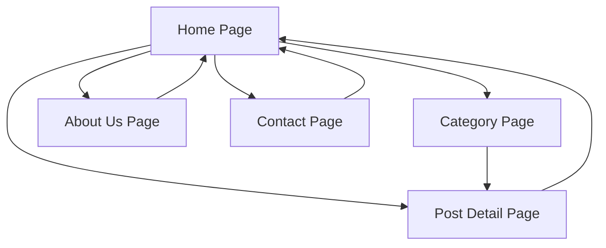

# Rohossholok Flutter App - Product Requirements Document

## 1. Product Overview

A lightweight Flutter mobile application for the Bengali blog website rohossholok.in that provides seamless access to crime thriller stories and blog posts through WordPress REST API integration.

The app serves Bengali readers who want to access rohossholok.in content on mobile devices, offering an optimized reading experience with automatic content synchronization whenever new stories are published on the website.

## 2. Core Features

### 2.1 User Roles

No user authentication required - this is a public read-only application.

### 2.2 Feature Module

Our WordPress blog app consists of the following main pages:

1. **Home Page**: Latest posts display, category sections, pull-to-refresh functionality
2. **Category Page**: Category-wise post listing with pagination
3. **Post Detail Page**: Full article view with HTML content rendering
4. **About Us Page**: Static page content from WordPress
5. **Contact Page**: Contact information and optional contact form

### 2.3 Page Details

| Page Name           | Module Name          | Feature description                                                             |
| ------------------- | -------------------- | ------------------------------------------------------------------------------- |
| Home Page           | Latest Posts Section | Display recent blog posts with thumbnail, title, category tag, and publish date |
| Home Page           | Category Sections    | Show posts grouped by categories (optional feature)                             |
| Home Page           | Pull-to-Refresh      | Allow users to refresh content by pulling down                                  |
| Home Page           | Drawer Navigation    | Sidebar menu with Home, Categories, About Us, Contact options                   |
| Category Page       | Post Listing         | Display posts filtered by selected category with pagination                     |
| Category Page       | Load More            | Implement pagination for better performance                                     |
| Post Detail Page    | Article Display      | Show full post content with title, featured image, and HTML rendering           |
| Post Detail Page    | Content Rendering    | Properly render HTML content from WordPress                                     |
| About Us Page       | Static Content       | Display About Us page content fetched from WordPress pages API                  |
| Contact Page        | Contact Information  | Show contact details and optional contact form                                  |
| Reusable Components | Post Card Widget     | Thumbnail image, title (max 2 lines), category tag, publish date                |
| Reusable Components | Loading States       | Loading spinners and error handling                                             |

## 3. Core Process

**Main User Flow:**
Users open the app and land on the Home page showing latest posts. They can navigate through the drawer menu to access different categories, view individual posts, or visit static pages like About Us and Contact. When selecting a category, users see filtered posts with pagination. Tapping on any post opens the detailed view with full content.

## 4. User Interface Design

### 4.1 Design Style

* Primary colors: Deep blue (#1565C0) and warm orange (#FF8F00) to reflect the mystery/thriller theme

* Secondary colors: Light grey (#F5F5F5) for backgrounds, dark grey (#424242) for text

* Button style: Rounded corners with no shadows, a professional neat and clean rounded ui.

* Font: Roboto for English text, Noto Sans Bengali for Bengali content

* Layout style: Card-based design with clean spacing and modern Material Design principles

* Icons: Material Design icons with Bengali-themed custom icons where appropriate

### 4.2 Page Design Overview

| Page Name        | Module Name          | UI Elements                                                                                                                         |
| ---------------- | -------------------- | ----------------------------------------------------------------------------------------------------------------------------------- |
| Home Page        | Latest Posts Section | Card layout with 16dp margins, featured images (16:9 aspect ratio), title in bold Bengali font, category chips with rounded corners |
| Home Page        | Drawer Navigation    | Material Design drawer with header image, menu items with icons, Bengali labels                                                     |
| Category Page    | Post Grid            | 2-column grid layout on mobile, card-based design with consistent spacing                                                           |
| Post Detail Page | Article Content      | Full-width featured image, large title text, justified content with proper line spacing for Bengali text                            |
| About Us Page    | Content Layout       | Single column layout with proper typography hierarchy                                                                               |
| Contact Page     | Information Display  | Clean list layout with contact details and optional form fields                                                                     |

### 4.3 Responsiveness

Mobile-first design with adaptive layouts for different screen sizes. Touch interaction optimization for Bengali readers with larger touch targets and proper spacing between interactive elements.
