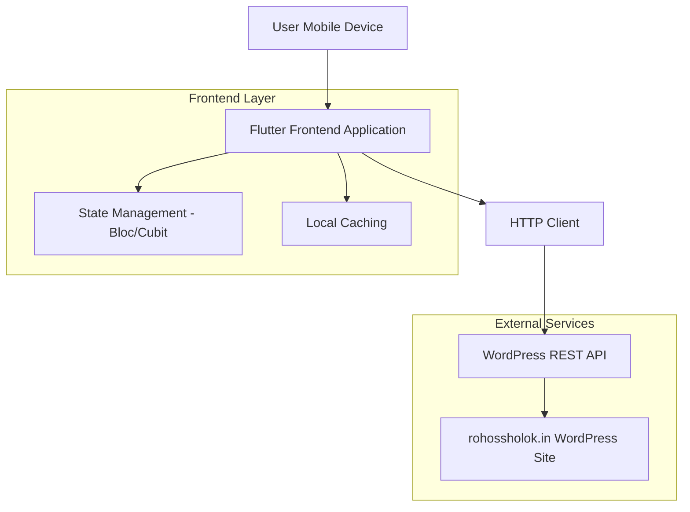
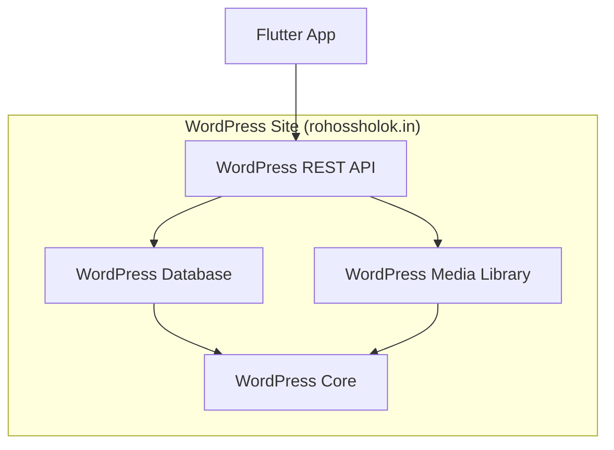
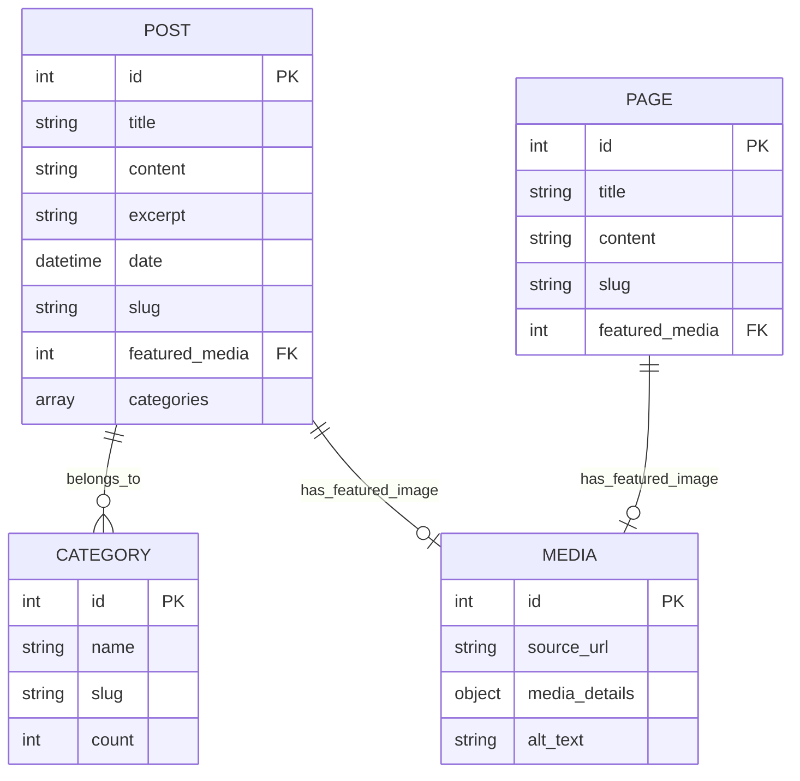

# Rohossholok Flutter App - Technical Architecture Document

## 1. Architecture Design



## 2. Technology Description

* Frontend: Flutter\@3.8+ + Dart\@3.8+

* State Management: flutter\_bloc\@8.1+ for state management

* HTTP Client: dio\@5.0+ for API calls

* Caching: hive\@2.2+ for local data storage

* HTML Rendering: flutter\_html\@3.0+ for WordPress content

* Image Caching: cached\_network\_image\@3.2+

* Navigation: go\_router\@12.0+ for routing

* JSON Serialization: json\_annotation\@4.8+ + json\_serializable\@6.7+

* Code Generation: build\_runner\@2.4+ + freezed\@2.4+

## 3. Route Definitions

| Route         | Purpose                                         |
| ------------- | ----------------------------------------------- |
| /             | Home page, displays latest posts and navigation |
| /category/:id | Category page, shows posts filtered by category |
| /post/:id     | Post detail page, displays full article content |
| /about        | About Us page, shows static page content        |
| /contact      | Contact page, displays contact information      |

## 4. API Definitions

### 4.1 WordPress REST API Endpoints

**Fetch Posts**

```
GET https://rohossholok.in/wp-json/wp/v2/posts
```

Query Parameters:

| Param Name | Param Type | isRequired | Description                                    |
| ---------- | ---------- | ---------- | ---------------------------------------------- |
| page       | int        | false      | Page number for pagination (default: 1)        |
| per\_page  | int        | false      | Number of posts per page (default: 10)         |
| categories | string     | false      | Comma-separated category IDs                   |
| \_embed    | boolean    | false      | Include embedded data (featured media, author) |

Response:

| Field Name       | Field Type | Description                    |
| ---------------- | ---------- | ------------------------------ |
| id               | int        | Post ID                        |
| title.rendered   | string     | Post title                     |
| content.rendered | string     | Post content (HTML)            |
| excerpt.rendered | string     | Post excerpt                   |
| date             | string     | Publication date (ISO 8601)    |
| categories       | array      | Array of category IDs          |
| featured\_media  | int        | Featured image ID              |
| \_embedded       | object     | Embedded media and author data |

**Fetch Categories**

```
GET https://rohossholok.in/wp-json/wp/v2/categories
```

Response:

| Field Name | Field Type | Description                 |
| ---------- | ---------- | --------------------------- |
| id         | int        | Category ID                 |
| name       | string     | Category name               |
| slug       | string     | Category slug               |
| count      | int        | Number of posts in category |

**Fetch Pages**

```
GET https://rohossholok.in/wp-json/wp/v2/pages
```

Query Parameters:

| Param Name | Param Type | isRequired | Description                             |
| ---------- | ---------- | ---------- | --------------------------------------- |
| slug       | string     | false      | Page slug (e.g., 'about-us', 'contact') |

Response:

| Field Name       | Field Type | Description         |
| ---------------- | ---------- | ------------------- |
| id               | int        | Page ID             |
| title.rendered   | string     | Page title          |
| content.rendered | string     | Page content (HTML) |
| slug             | string     | Page slug           |

**Fetch Media**

```
GET https://rohossholok.in/wp-json/wp/v2/media/:id
```

Response:

| Field Name           | Field Type | Description           |
| -------------------- | ---------- | --------------------- |
| id                   | int        | Media ID              |
| source\_url          | string     | Full size image URL   |
| media\_details.sizes | object     | Different image sizes |

## 5. Server Architecture Diagram

Since this is a client-only application consuming WordPress REST API, there's no custom server architecture. The app directly communicates with the WordPress site's built-in REST API.



## 6. Data Model

### 6.1 Data Model Definition



### 6.2 Data Definition Language

**Post Model (Dart/Flutter)**

```dart
@freezed
class PostModel with _$PostModel {
  const factory PostModel({
    required int id,
    required RenderedContent title,
    required RenderedContent content,
    required RenderedContent excerpt,
    required DateTime date,
    required String slug,
    @JsonKey(name: 'featured_media') int? featuredMedia,
    required List<int> categories,
    @JsonKey(name: '_embedded') EmbeddedData? embedded,
  }) = _PostModel;
  
  factory PostModel.fromJson(Map<String, dynamic> json) => 
    _$PostModelFromJson(json);
}

@freezed
class RenderedContent with _$RenderedContent {
  const factory RenderedContent({
    required String rendered,
  }) = _RenderedContent;
  
  factory RenderedContent.fromJson(Map<String, dynamic> json) => 
    _$RenderedContentFromJson(json);
}
```

**Category Model (Dart/Flutter)**

```dart
@freezed
class CategoryModel with _$CategoryModel {
  const factory CategoryModel({
    required int id,
    required String name,
    required String slug,
    required int count,
  }) = _CategoryModel;
  
  factory CategoryModel.fromJson(Map<String, dynamic> json) => 
    _$CategoryModelFromJson(json);
}
```

**Page Model (Dart/Flutter)**

```dart
@freezed
class PageModel with _$PageModel {
  const factory PageModel({
    required int id,
    required RenderedContent title,
    required RenderedContent content,
    required String slug,
    @JsonKey(name: 'featured_media') int? featuredMedia,
  }) = _PageModel;
  
  factory PageModel.fromJson(Map<String, dynamic> json) => 
    _$PageModelFromJson(json);
}
```

**Media Model (Dart/Flutter)**

```dart
@freezed
class MediaModel with _$MediaModel {
  const factory MediaModel({
    required int id,
    @JsonKey(name: 'source_url') required String sourceUrl,
    @JsonKey(name: 'media_details') MediaDetails? mediaDetails,
    @JsonKey(name:
```

